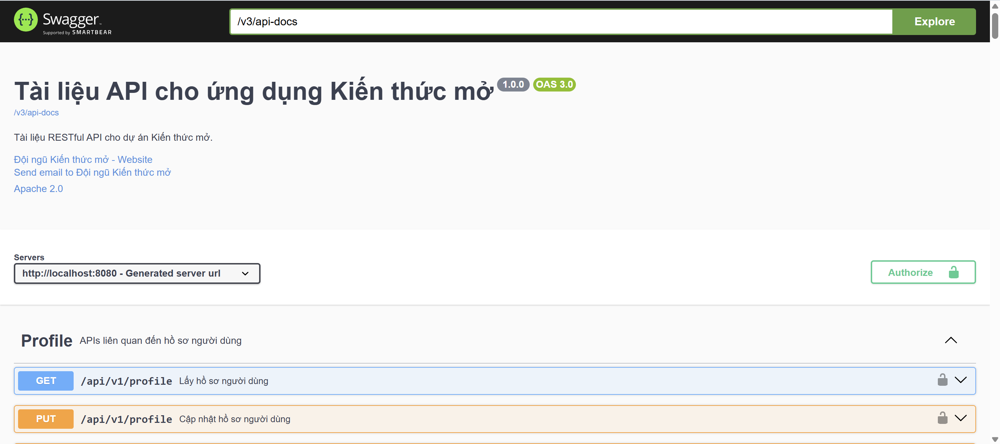
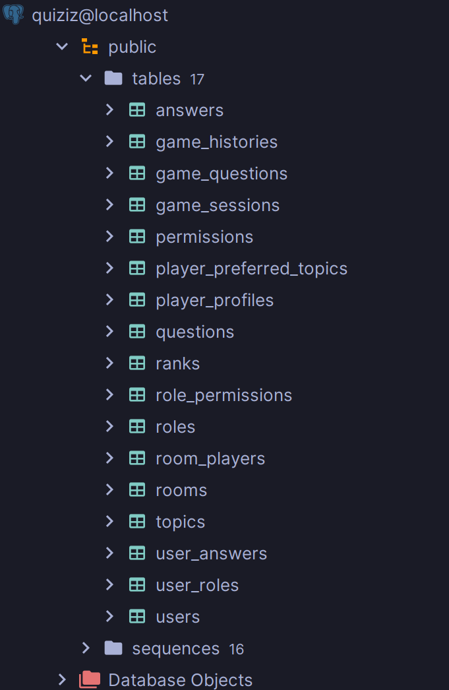

# 🎮 QUIZIZZ - HỆ THỐNG THI TRẮC NGHIỆM TRỰC TUYẾN REAL-TIME

[](https://www.oracle.com/java/)
[](https://spring.io/projects/spring-boot)
[](https://www.postgresql.org/)
[](https://redis.io/)
[](https://socket.io/)

> Hệ thống thi trắc nghiệm trực tuyến tương tác real-time tương tự Kahoot/Quizizz, được xây dựng với Spring Boot và Socket.IO

## 📋 MỤC LỤC

- [Giới Thiệu](#-giới-thiệu)
- [Tính Năng](#-tính-năng)
- [Công Nghệ](#-công-nghệ-sử-dụng)
- [Kiến Trúc](#-kiến-trúc-hệ-thống)
- [Cài Đặt](#-cài-đặt)
- [Cấu Hình](#-cấu-hình)
- [API Documentation](#-api-documentation)
- [Database Schema](#-database-schema)
- [Socket Events](#-socket-events)
- [Screenshots](#-screenshots)
- [Đóng Góp](#-đóng-góp)
- [License](#-license)

## 🎯 GIỚI THIỆU

**Kiến thức mở** là một hệ thống thi trắc nghiệm trực tuyến cho phép giáo viên/người tổ chức tạo các bài kiểm tra tương tác và học sinh/người chơi tham gia trả lời câu hỏi theo thời gian thực. Hệ thống hỗ trợ nhiều chế độ chơi, tính điểm tự động, và xếp hạng real-time.

### 🌟 Điểm Nổi Bật

- ⚡ **Real-time Synchronization**: Tất cả người chơi nhận câu hỏi và cập nhật đồng thời
- 🎮 **Multiple Game Modes**: Hỗ trợ chế độ 1vs1 và Battle Royale
- 🏆 **Smart Scoring**: Tính điểm dựa trên độ chính xác và tốc độ trả lời
- 👥 **Room Management**: Quản lý phòng chơi với host controls
- 📊 **Live Leaderboard**: Bảng xếp hạng cập nhật real-time
- 🔐 **Secure Authentication**: JWT-based authentication
- 📱 **Responsive Design Ready**: Backend API sẵn sàng cho mọi platform

## ✨ TÍNH NĂNG

### 🔐 Authentication & Authorization
- ✅ Đăng ký/Đăng nhập với JWT
- ✅ Role-based access control (Admin, Teacher, Student)
- ✅ Quên mật khẩu & Reset password
- ✅ Email verification

### 🏠 Room Management
- ✅ Tạo phòng với cấu hình tùy chỉnh
- ✅ Join phòng bằng room code hoặc ID
- ✅ Tự động chuyển host khi host rời phòng
- ✅ Kick players (host only)
- ✅ Public/Private rooms
- ✅ Real-time player list updates

### 🎮 Game Features
- ✅ Multiple choice questions (4 đáp án)
- ✅ Countdown timer đồng bộ
- ✅ Tính điểm theo tốc độ + độ chính xác
- ✅ Hiển thị kết quả từng câu
- ✅ Ranking system với leaderboard
- ✅ Game history & statistics

### 📊 Topic & Question Management
- ✅ Quản lý chủ đề (Topics)
- ✅ CRUD operations cho câu hỏi
- ✅ Bulk import/export questions
- ✅ Question bank với nhiều độ khó

### 🎨 Additional Features
- ✅ Avatar upload với MinIO
- ✅ User profiles
- ✅ Search & filter rooms
- ✅ Pagination support
- ✅ Swagger API documentation

## 🛠️ CÔNG NGHỆ SỬ DỤNG

### Backend Framework
- **Spring Boot 3.5.6** - Core framework
- **Spring Security** - Authentication & Authorization
- **Spring Data JPA** - Database ORM
- **Spring Data Redis** - Caching & Session management
- **Spring Mail** - Email service

### Database
- **PostgreSQL 18.0** - Primary database
- **Redis** - Caching & real-time data
- **Hibernate** - ORM framework

### Real-time Communication
- **Socket.IO (Netty)** - WebSocket communication
- **Event-driven Architecture** - Asynchronous processing

### Security
- **JWT (JSON Web Token)** - Stateless authentication
- **BCrypt** - Password hashing

### Storage
- **MinIO** - Object storage cho images/avatars

### Documentation & Testing
- **Swagger/OpenAPI 3.0** - API documentation
- **JUnit 5** - Unit testing
- **Testcontainers** - Integration testing

### Build Tools
- **Maven** - Dependency management
- **Lombok** - Reduce boilerplate code
- **MapStruct** - Object mapping

## 🏗️ KIẾN TRÚC HỆ THỐNG

```
┌─────────────────────────────────────────────────────────────┐
│                        CLIENT LAYER                          │
│  (Web Browser, Mobile App, Desktop App)                     │
└─────────────────────────────────────────────────────────────┘
                            │
                            ▼
┌─────────────────────────────────────────────────────────────┐
│                     API GATEWAY LAYER                        │
│  ┌──────────────┐              ┌──────────────┐            │
│  │  REST API    │              │  Socket.IO   │            │
│  │  Port: 8080  │              │  Port: 9092  │            │
│  └──────────────┘              └──────────────┘            │
└─────────────────────────────────────────────────────────────┘
                            │
                            ▼
┌─────────────────────────────────────────────────────────────┐
│                    APPLICATION LAYER                         │
│  ┌──────────────┐  ┌──────────────┐  ┌──────────────┐     │
│  │ Controllers  │  │   Services   │  │   Mappers    │     │
│  └──────────────┘  └──────────────┘  └──────────────┘     │
│  ┌──────────────┐  ┌──────────────┐  ┌──────────────┐     │
│  │   Security   │  │    Events    │  │   Helpers    │     │
│  └──────────────┘  └──────────────┘  └──────────────┘     │
└─────────────────────────────────────────────────────────────┘
                            │
                            ▼
┌─────────────────────────────────────────────────────────────┐
│                    PERSISTENCE LAYER                         │
│  ┌──────────────┐  ┌──────────────┐  ┌──────────────┐     │
│  │ Repositories │  │   Entities   │  │     DTOs     │     │
│  └──────────────┘  └──────────────┘  └──────────────┘     │
└─────────────────────────────────────────────────────────────┘
                            │
                            ▼
┌─────────────────────────────────────────────────────────────┐
│                      DATA LAYER                              │
│  ┌──────────────┐  ┌──────────────┐  ┌──────────────┐     │
│  │ PostgreSQL   │  │    Redis     │  │    MinIO     │     │
│  │  Port: 5436  │  │  Port: 6384  │  │  Port: 9000  │     │
│  └──────────────┘  └──────────────┘  └──────────────┘     │
└─────────────────────────────────────────────────────────────┘
```

### 📁 Cấu Trúc Thư Mục

```
quizizz/
├── src/
│   ├── main/
│   │   ├── java/org/example/quizizz/
│   │   │   ├── common/              # Shared components
│   │   │   │   ├── config/          # Configuration classes
│   │   │   │   ├── constants/       # Constants & Enums
│   │   │   │   ├── event/           # Event classes
│   │   │   │   └── exception/       # Exception handlers
│   │   │   ├── controller/          # REST & Socket controllers
│   │   │   │   ├── api/             # REST API endpoints
│   │   │   │   └── socketio/        # Socket.IO handlers
│   │   │   ├── mapper/              # MapStruct mappers
│   │   │   ├── model/               # Data models
│   │   │   │   ├── dto/             # Data Transfer Objects
│   │   │   │   └── entity/          # JPA Entities
│   │   │   ├── repository/          # JPA Repositories
│   │   │   ├── security/            # Security components
│   │   │   ├── service/             # Business logic
│   │   │   │   ├── helper/          # Helper services
│   │   │   │   ├── Implement/       # Service implementations
│   │   │   │   └── Interface/       # Service interfaces
│   │   │   └── util/                # Utility classes
│   │   └── resources/
│   │       ├── application.yml      # Main configuration
│   │       └── templates/           # Email templates
│   └── test/                        # Test classes
├── API_DOCUMENTATION.md             # API docs for frontend
├── README.md                        # This file
├── pom.xml                          # Maven configuration
└── docker-compose.yml               # Docker setup
```

## 🚀 CÀI ĐẶT

### Yêu Cầu Hệ Thống

- **Java 21** hoặc cao hơn
- **Maven 3.8+**
- **PostgreSQL 14+**
- **Redis 6+**
- **MinIO** (optional, cho file storage)

### Bước 1: Clone Repository

```bash
git clone https://github.com/yourusername/quizizz.git
cd quizizz
```

### Bước 2: Cài Đặt Dependencies

```bash
mvn clean install
```

### Bước 3: Setup Database

#### PostgreSQL
```sql
CREATE DATABASE quiziz;
CREATE USER demo WITH PASSWORD 'demo';
GRANT ALL PRIVILEGES ON DATABASE quiziz TO demo;
```

#### Redis
```bash
# Sử dụng Docker
docker run -d --name redis -p 6384:6379 redis:latest redis-server --requirepass demo
```

#### MinIO (Optional)
```bash
# Sử dụng Docker
docker run -d --name minio \
  -p 9000:9000 -p 9001:9001 \
  -e "MINIO_ROOT_USER=minioadmin" \
  -e "MINIO_ROOT_PASSWORD=minioadmin123" \
  minio/minio server /data --console-address ":9001"
```

### Bước 4: Cấu Hình Application

Chỉnh sửa file `src/main/resources/application.yml`:

```yaml
spring:
  datasource:
    url: jdbc:postgresql://localhost:5436/quiziz
    username: demo
    password: demo
  data:
    redis:
      host: localhost
      port: 6384
      password: demo
  mail:
    host: smtp.gmail.com
    username: your-email@gmail.com
    password: your-app-password

minio:
  endpoint: http://localhost:9000
  access-key: minioadmin
  secret-key: minioadmin123
```

### Bước 5: Chạy Application

```bash
mvn spring-boot:run
```

Application sẽ chạy tại:
- **REST API**: http://localhost:8080
- **Socket.IO**: ws://localhost:9092
- **Swagger UI**: http://localhost:8080/swagger-ui.html

## ⚙️ CẤU HÌNH

### Application Properties

| Property | Description | Default |
|----------|-------------|---------|
| `server.port` | REST API port | 8080 |
| `socketio.port` | Socket.IO port | 9092 |
| `jwt.secret-key` | JWT secret key | (auto-generated) |
| `jwt.access-expiration` | Access token expiration (ms) | 86400000 (24h) |
| `jwt.refresh-expiration` | Refresh token expiration (ms) | 604800000 (7d) |

### Database Configuration

```yaml
spring:
  jpa:
    hibernate:
      ddl-auto: update  # create, update, validate, none
    show-sql: true      # Show SQL queries in console
```

### Redis Configuration

```yaml
spring:
  data:
    redis:
      host: localhost
      port: 6384
      password: demo
      timeout: 60000
```

## 📚 API DOCUMENTATION

### REST API Endpoints

#### Authentication
```
POST   /api/v1/auth/register      - Đăng ký tài khoản
POST   /api/v1/auth/login         - Đăng nhập
POST   /api/v1/auth/refresh       - Refresh token
POST   /api/v1/auth/logout        - Đăng xuất
POST   /api/v1/auth/forgot-password - Quên mật khẩu
POST   /api/v1/auth/reset-password  - Reset mật khẩu
```

#### Room Management
```
POST   /api/v1/rooms              - Tạo phòng mới
GET    /api/v1/rooms              - Lấy danh sách phòng
GET    /api/v1/rooms/{id}         - Lấy thông tin phòng
POST   /api/v1/rooms/join         - Join phòng bằng code
POST   /api/v1/rooms/{id}/join    - Join phòng bằng ID
DELETE /api/v1/rooms/{id}         - Xóa phòng
GET    /api/v1/rooms/{id}/players - Lấy danh sách players
```

#### Topics & Questions
```
GET    /api/v1/topics             - Lấy danh sách topics
POST   /api/v1/topics             - Tạo topic mới
GET    /api/v1/questions          - Lấy danh sách câu hỏi
POST   /api/v1/questions          - Tạo câu hỏi mới
PUT    /api/v1/questions/{id}     - Cập nhật câu hỏi
DELETE /api/v1/questions/{id}     - Xóa câu hỏi
```

### Socket.IO Events

Chi tiết đầy đủ xem tại [API_DOCUMENTATION.md](./API_DOCUMENTATION.md)

#### Client → Server
```javascript
// Room events
socket.emit('create-room', data);
socket.emit('join-room', data);
socket.emit('leave-room', data);

// Game events
socket.emit('start-game', data);
socket.emit('submit-answer', data);
socket.emit('next-question', data);
socket.emit('end-game', data);
```

#### Server → Client
```javascript
// Room events
socket.on('player-joined', callback);
socket.on('player-left', callback);
socket.on('host-changed', callback);

// Game events
socket.on('game-started', callback);
socket.on('next-question', callback);
socket.on('countdown-tick', callback);
socket.on('game-finished', callback);
```

## 🗄️ DATABASE SCHEMA

### Core Tables

```sql
-- Users & Authentication
users
user_roles
roles
permissions
role_permissions

-- Game Content
topics
questions
answers

-- Room Management
rooms
room_players

-- Game Sessions
game_sessions
game_questions
user_answers
game_history

-- Rankings
ranks
```

### Entity Relationships

```
User ──┬── UserRole ──── Role ──── RolePermission ──── Permission
       │
       ├── Room (as owner)
       │
       ├── RoomPlayers
       │
       └── UserAnswer ──── GameSession ──── GameQuestion ──── Question
                                                                  │
                                                                  └── Answer
```

## 🎮 SOCKET EVENTS

### Room Events Flow

```
1. User A tạo phòng
   → emit: create-room
   → receive: room-created-success
   → broadcast: room-created (to room-list subscribers)

2. User B join phòng
   → emit: join-room
   → receive: room-joined-success
   → broadcast: player-joined (to all in room)
   → broadcast: room-players-updated

3. User C rời phòng
   → emit: leave-room
   → receive: room-left-success
   → broadcast: player-left (to all in room)
   → broadcast: room-players-updated
```

### Game Events Flow

```
1. Host bấm Start
   → emit: start-game
   → broadcast: game-started (with first question)
   → start countdown timer

2. Players trả lời
   → emit: submit-answer
   → receive: answer-submitted (personal result)
   → broadcast: player-answered (to others)

3. Hết thời gian
   → broadcast: time-up
   → auto trigger next question

4. Host chuyển câu tiếp theo
   → emit: next-question
   → broadcast: next-question (with new question)
   → start countdown timer

5. Hết câu hỏi
   → broadcast: game-finished (with final results)
```

## 📸 SCREENSHOTS

### Swagger API Documentation

### Database Schema


## 🧪 TESTING

### Chạy Unit Tests
```bash
mvn test
```

### Chạy Integration Tests
```bash
mvn verify
```

### Test Coverage
```bash
mvn clean test jacoco:report
```

## 📊 PERFORMANCE

- **Response Time**: < 100ms (average)
- **Concurrent Users**: 1000+ users
- **Real-time Latency**: < 50ms
- **Database Queries**: Optimized with indexing
- **Caching**: Redis for frequently accessed data

## 🔒 SECURITY

- ✅ JWT-based authentication
- ✅ Password hashing with BCrypt
- ✅ CORS configuration
- ✅ SQL injection prevention
- ✅ XSS protection
- ✅ Rate limiting
- ✅ Input validation

## 🤝 ĐÓNG GÓP

Contributions are welcome! Please follow these steps:

1. Fork the repository
2. Create your feature branch (`git checkout -b feature/AmazingFeature`)
3. Commit your changes (`git commit -m 'Add some AmazingFeature'`)
4. Push to the branch (`git push origin feature/AmazingFeature`)
5. Open a Pull Request

### Coding Standards
- Follow Java naming conventions
- Write clean, readable code
- Add comments in Vietnamese for complex logic
- Write unit tests for new features
- Update documentation

## 📝 TODO

- [ ] Add more game modes
- [ ] Implement team-based games
- [ ] Add voice chat support
- [ ] Mobile app development
- [ ] AI-powered question generation
- [ ] Advanced analytics dashboard
- [ ] Multi-language support

## 📄 LICENSE

This project is licensed under the MIT License - see the [LICENSE](LICENSE) file for details.

## 👥 AUTHORS

- **toobidu** - *Initial work* - [GitHub](https://github.com/toobidu)

## 🙏 ACKNOWLEDGMENTS

- Spring Boot Team
- Socket.IO Team
- PostgreSQL Community
- Redis Community
- All contributors

## 📞 CONTACT

- **Email**: dungto0300567@gmail.com
- **GitHub**: [@toobidu](https://github.com/toobidu)
---

⭐ **Nếu project này hữu ích, hãy cho một star nhé!** ⭐

Made with ❤️ by [Tiến Dũng]
